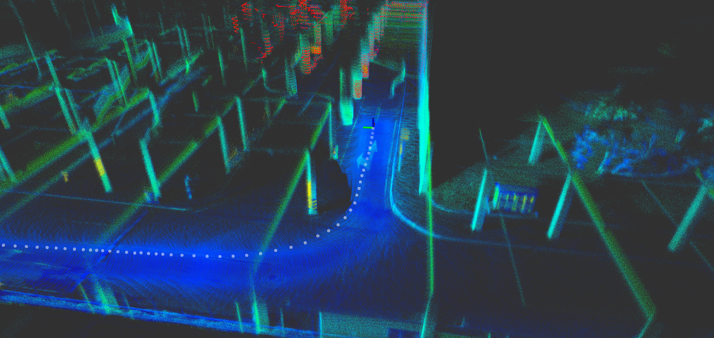
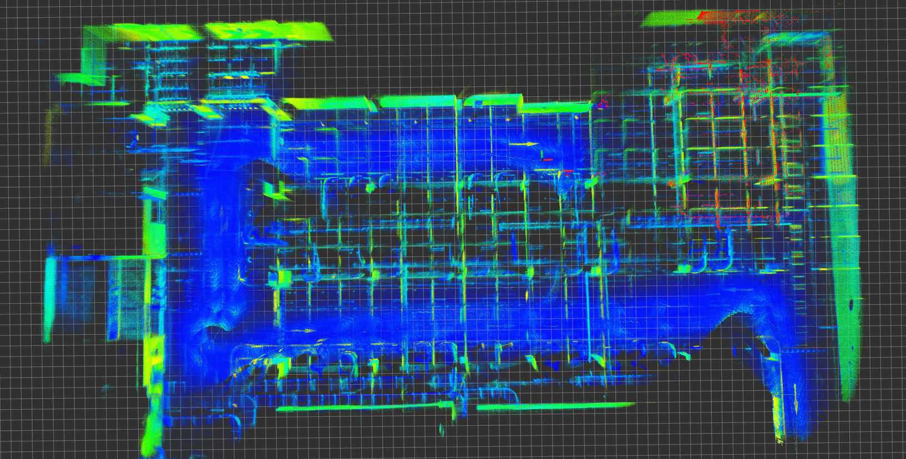

# LeGO-LIVOX
### 一个针对车辆行驶的轻量化的Livox SLAM系统实现

___




将LeGO LOAM的思路迁移到大疆Livox Horizon激光雷达上，从而实现轻量化的激光SLAM系统。本项目在算法上的创新性贡献不大，但是在代码实现方面有如下几点改善：

- [x] 地面提取

  由于livox的点云不像传统旋转式机械激光雷达那样规则分布，因此我们采用[Run_based_segmentation](https://github.com/VincentCheungM/Run_based_segmentation)的地平面拟合方法进行地面提取。

- [ ] 点云聚类分割

  项目中有尝试[autoware.ai](https://github.com/Autoware-AI/autoware.ai)中的欧式聚类方法进行点云聚类分割，但是在速度和分割效果上还没找到一个好的平衡点，因此暂时还没使用。

- [x] 前端里程计关于`pitch`，`roll`以及`tz`的计算

  我们之前花了较大力气进行地面拟合和提取，得到较为准确的地面的平面方程。所以在前端部分直接通过两次扫描的地面方程进行`pitch`，`roll`以及`tz`的计算，没有想Lego-loam那样进行ICP配准。

- [x] 使用右扰动模型推导ICP配准的雅克比

  LOAM和lego-loam中，关于旋转的求导相信让很多朋友困惑了很久。因此，在本项目中我们采用右扰动模型进行旋转求导。从建图效果上可以表明理论上的数学推导是没问题的，剩下的就是精度问题。

- [ ] 回环检测

  在后端部分已经构建好基于ISAM2的位姿图优化框架。后续会加上回环检测，计划使用**[scancontext](https://github.com/irapkaist/scancontext)**实现回环检测。

### 1. 编译

依赖：

* **Ubuntu 18.04** and **ROS melodic**
* **PCL 1.9**
* **Eigen 3.3.7**
* **[livox_ros_driver](https://github.com/Livox-SDK/livox_ros_driver)**
* **GTSAM 4.1**

```
cd ~/ros/catkin_ws/src
git clone https://github.com/GDUT-Kyle/LEGO-LIVOX.git
cd ../
catkin build lego_livox
source devel/setup.bash
```

### 2. rosbag测试

由于不确定自己录制的数据包能否传播（没有测绘资质），建议下载Livox官方提供的数据包[parking lot rosbag](https://terra-1-g.djicdn.com/65c028cd298f4669a7f0e40e50ba1131/demo/2020_parking_lot.bag)进行测试

```
roslaunch lego_livox lins_slam.launch
rosbag play 2020_parking_lot.bag --clock
```



### 3. 实时测试

```
roslaunch livox_ros_driver livox_lidar_msg.launch
roslaunch lego_livox lins_slam.launch
```

### 4. 备注与提醒

* 算法与代码勘误

  该项目仍处于开发阶段，由于本人天性愚笨，相信在理论推导方面仍有不少错误，从而影响到代码实现的有效性。除此之外，本人代码能力较差，代码架构的设计不是很合理。望各位前辈指出其中不妥之处。以便改进，不胜感激。

* 性能测试与验证

  该项目尚未进行过严格的性能测试，但是与[livox_horizon_loam](https://github.com/Livox-SDK/livox_horizon_loam)相比，我们可以在较低运算量的条件下，得到相似的建图效果。但是不可否认，鲁棒性和精度略低。

* 甩锅认错说明

  我没错！（实不相瞒，本人比较菜，希望各位老师指正批评.....）

### 5. 参考资料

[livox_horizon_loam](https://github.com/Livox-SDK/livox_horizon_loam)

[LeGO-LOAM](https://github.com/RobustFieldAutonomyLab/LeGO-LOAM)

[Run_based_segmentation](https://github.com/VincentCheungM/Run_based_segmentation)

《视觉SLAM十四讲：从理论到实践》
